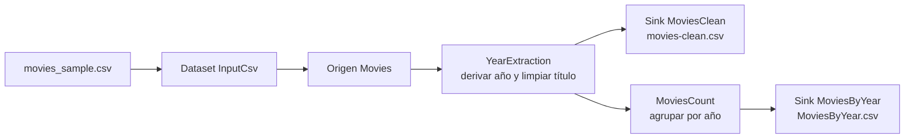

# Azure Mapping Data Flow | ETL visual para datos de películas

[English](README.md) | [Español](README.es.md)

Laboratorio focalizado de Azure Data Factory que transforma un CSV de películas mediante un **Mapping Data Flow** no-code/low-code. La implementación lee un dataset delimitado, deriva el año desde cada título, elimina el sufijo del año, agrega películas por año y escribe dos salidas CSV curadas.

El repositorio utiliza una muestra pública pequeña y no contiene credenciales de Azure, cadenas de conexión, rutas de cuentas de almacenamiento ni datos operativos privados.

## Rol dentro del portfolio

Este proyecto complementa [Azure End-to-End Data Pipeline](https://github.com/hernano88/azure-end-to-end-data-pipeline). El repositorio end-to-end demuestra la orquestación entre ADF, ADLS, Databricks, PySpark, Spark SQL y forecasting; este laboratorio aísla el **ETL visual dentro de ADF** y facilita la explicación de cada transformación del Mapping Data Flow.

## Arquitectura



La canalización publicada `MoviesMappingFlow` ejecuta el Mapping Data Flow `dataflow1` mediante una actividad `ExecuteDataFlow`.

## Qué demuestra el proyecto

- diseño de ETL visual en Azure Data Factory;
- datasets de origen y destino con texto delimitado;
- proyección de esquema para `movieId`, `title` y `genres`;
- expresiones de columna derivada y conversión de tipos;
- ramificación de un mismo flujo transformado hacia salidas de detalle y agregadas;
- agregación sin utilizar un notebook de Databricks;
- nombres de archivos de salida explícitos y partición única para el laboratorio;
- validación de la muestra pública mediante una prueba local sin dependencias.

## Implementación verificada en Azure

La canalización de ADF contiene una actividad que ejecuta el Mapping Data Flow:


El Data Flow contiene las transformaciones publicadas `Movies`, `YearExtraction`, `MoviesCount`, `MoviesClean` y `MoviesByYear`:


La configuración de Azure fue revisada en modo lectura el 22 de julio de 2026. El script exacto de transformación publicado se conserva en [`transformations/dataflow-script.txt`](transformations/dataflow-script.txt) y el alcance de la evidencia está documentado en [`docs/VERIFIED_EVIDENCE.md`](docs/VERIFIED_EVIDENCE.md).

## Columnas derivadas

El Data Flow publicado utiliza esta expresión:

```text
titleExtraction = toInteger(trim(right(title, 6), '()'))
title = toString(left(title, length(title)-6))
```

Para la entrada `Toy Story (1995)`, la transformación:

1. toma los últimos seis caracteres, `(1995)`;
2. elimina los paréntesis;
3. convierte `1995` a un entero llamado `titleExtraction`;
4. elimina del título el sufijo de seis caracteres correspondiente al año.

| movieId | título de origen | título transformado* | titleExtraction |
|---:|---|---|---:|
| 1 | Toy Story (1995) | Toy Story | 1995 |
| 2 | Jumanji (1995) | Jumanji | 1995 |

\*La expresión actual puede conservar un espacio al final luego de quitar el sufijo. Una versión endurecida para producción debería envolver el título limpio en `trim()` y validar el formato del sufijo antes de convertirlo.

## Agregación y salidas

`MoviesCount` agrupa el flujo transformado por `titleExtraction` y aplica `count()`:

```sql
SELECT
    title_extraction,
    COUNT(*) AS movies_count
FROM movies
GROUP BY title_extraction;
```

El SQL es una equivalencia conceptual; la transformación implementada es la expresión ADF incluida en el script publicado.

Para la muestra de cuatro filas, el resultado esperado es:

| titleExtraction | MoviesCount |
|---:|---:|
| 1995 | 3 |
| 1996 | 1 |

| Sink | Flujo de entrada | Dataset | Archivo | Objetivo |
|---|---|---|---|---|
| `MoviesClean` | `YearExtraction` | `OutputCsv` | `movies-clean.csv` | Datos transformados a nivel de película |
| `MoviesByYear` | `MoviesCount` | `OutputCsv` | `MoviesByYear.csv` | Cantidades a nivel de año |

Ambos sinks utilizan una partición hash. Es una decisión práctica para obtener nombres de archivo determinísticos en un laboratorio pequeño, pero no se presenta como una estrategia escalable de particionamiento productivo.

## Copy Activity vs. Mapping Data Flow

| Copy Activity | Mapping Data Flow |
|---|---|
| Principalmente mueve datos | Transforma datos |
| Ingesta origen-destino | ETL origen-transformaciones-sink |
| Transformación limitada de filas o columnas | Deriva, filtra, une y agrega |
| Adecuada para aterrizar datos raw | Adecuada para transformaciones visuales curadas |

## Estructura

```text
.
|-- data/
|   |-- expected_movies_by_year.csv
|   `-- movies_sample.csv
|-- docs/
|   |-- VERIFIED_EVIDENCE.md
|   `-- images/
|       |-- 01-movies-mapping-pipeline.png
|       `-- 02-mapping-data-flow.png
|-- tests/
|   `-- test_sample_contract.py
|-- transformations/
|   |-- dataflow-script.txt
|   `-- dataflow-specification.md
|-- README.md
`-- README.es.md
```

## Validación local

La prueba local no reemplaza la ejecución en Azure. Verifica que el fixture público cumpla el contrato de títulos y produzca las cantidades por año documentadas:

```bash
python -m unittest discover -s tests -v
```

No requiere paquetes de terceros.

## Alcance y limitaciones

- Es un laboratorio de portfolio, no una carga productiva.
- La muestra contiene cuatro registros públicos ilustrativos.
- La expresión actual asume que todos los títulos terminan en `(YYYY)`.
- El flujo publicado permite schema drift y tiene deshabilitada la validación del esquema.
- El título transformado puede conservar espacios al final.
- Las capturas demuestran la canalización y las transformaciones configuradas; no constituyen una afirmación de SLA, benchmark de escala o ejecución productiva monitoreada.
- Los datasets y linked services de Azure deben estar previamente configurados en un ambiente autorizado.

Estas limitaciones son puntos de conversación útiles para una entrevista: el endurecimiento productivo incorporaría manejo de títulos mal formados, validación explícita del esquema, desvío de rechazos, controles de salida y particionamiento apropiado para la escala.

## Resumen profesional

> Construí un Mapping Data Flow en Azure Data Factory que lee datos de películas desde un CSV, deriva un año numérico desde el título, genera una salida curada a nivel de película y ramifica el mismo flujo hacia una agregación anual. Una canalización separada de ADF ejecuta el flujo. Verifiqué en Azure las expresiones publicadas y la configuración de los sinks, documenté el alcance de la evidencia y agregué una prueba reproducible del contrato para la muestra pública.

Para consultar el caso completo de orquestación, procesamiento lakehouse y forecasting, ver [Azure End-to-End Data Pipeline](https://github.com/hernano88/azure-end-to-end-data-pipeline).
