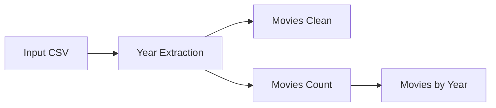

# Azure Mapping Data Flow — Movies

Proyecto de transformación visual en Azure Data Factory utilizando **Mapping Data Flows**.

El flujo lee un archivo CSV de películas, extrae el año contenido en el título, genera una versión limpia del dataset y crea una agregación con la cantidad de películas por año.

---

## Objetivo

Demostrar cómo realizar transformaciones de datos sin escribir un notebook de Databricks:

- lectura de un CSV;
- creación de una columna derivada;
- extracción del año desde el título;
- limpieza de datos;
- agregación;
- escritura de dos salidas.

---

## Flujo



<!-- CAPTURA 01: Data Flow completo -->


---

## Columna derivada

Ejemplo de título:

```text
Toy Story (1995)
```

Expresión utilizada en el Data Flow:

```text
toInteger(trim(right(title, 6), '()'))
```

Transformación:

```text
Toy Story (1995)
        ↓
(1995)
        ↓
1995
        ↓
integer
```

Resultado:

| movieId | title | year |
|---:|---|---:|
| 1 | Toy Story (1995) | 1995 |
| 2 | Jumanji (1995) | 1995 |

<!-- CAPTURA 02: configuración de Derived Column -->
La vista completa del Data Flow muestra `YearExtraction`, la agregación `MoviesCount` y los sinks `MoviesClean` y `MoviesByYear`.

---

## Agregación

El Data Flow agrupa por año y calcula el número de películas:

| year | movie_count |
|---:|---:|
| 1995 | 2 |
| 1996 | 1 |

Equivalencia conceptual en SQL:

```sql
SELECT
    year,
    COUNT(*) AS movie_count
FROM movies
GROUP BY year;
```

---

## Diferencia entre Copy Activity y Data Flow

| Copy Activity | Mapping Data Flow |
|---|---|
| Mueve datos | Transforma datos |
| Origen → destino | Source → transformations → sink |
| No cambia filas o columnas | Filtra, deriva, agrega y une |
| Ideal para ingesta | Ideal para ETL visual |

---

## Estructura

```text
.
├── data/
│   └── movies_sample.csv
├── docs/
│   ├── CAPTURAS_PENDIENTES.md
│   └── images/
├── transformations/
│   └── dataflow-specification.md
└── README.md
```

---

## Capturas recomendadas

1. Data Flow completo.
2. Source del CSV.
3. Derived Column con la expresión.
4. Aggregate `MoviesCount`.
5. Sink `MoviesClean`.
6. Sink `MoviesByYear`.
7. Data Preview antes y después.

---

## Presentación breve

> Implementé un Mapping Data Flow en Azure Data Factory para transformar un CSV de películas de forma visual. Extraje el año desde el título mediante una columna derivada, generé un dataset limpio y una agregación con la cantidad de películas por año. El ejercicio me permitió comparar Data Flow con Copy Activity y con transformaciones programadas en Databricks.
