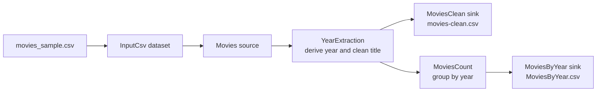
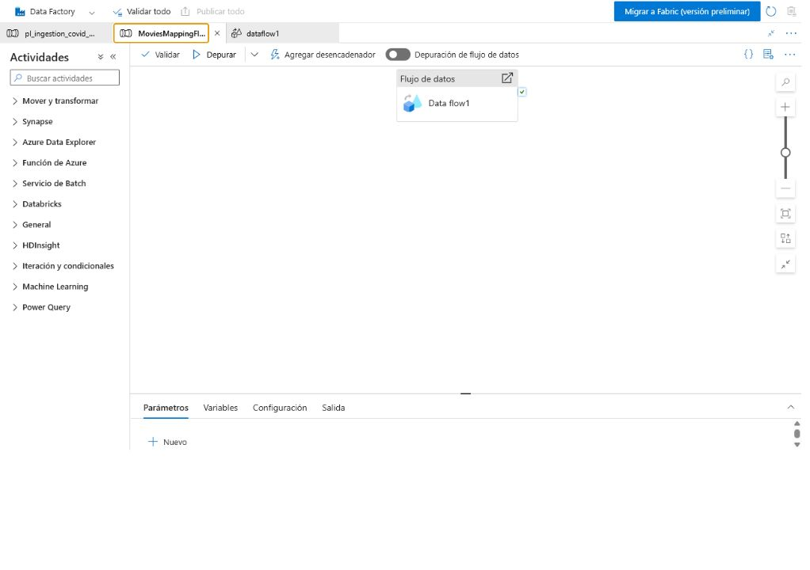
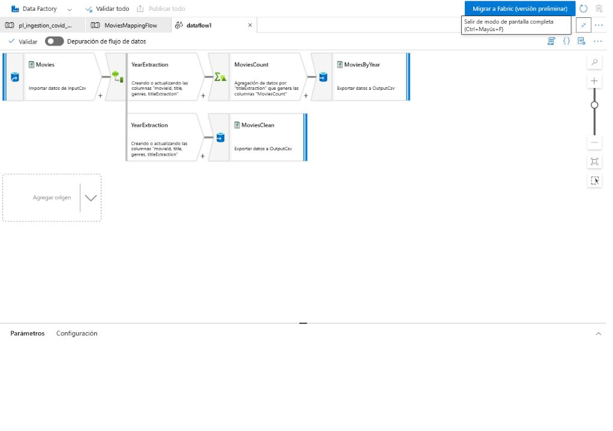

# Azure Mapping Data Flow | Visual ETL for Movie Data

[English](README.md) | [Español](README.es.md)

A focused Azure Data Factory lab that transforms a movie CSV with a no-code/low-code **Mapping Data Flow**. The implementation reads a delimited dataset, derives a year from each movie title, removes the year suffix from the title, aggregates movies by year and writes two curated CSV outputs.

The repository uses a small public sample and contains no Azure credentials, connection strings, storage-account paths or private operational data.

## Portfolio role

This project complements the broader [Azure End-to-End Data Pipeline](https://github.com/hernano88/azure-end-to-end-data-pipeline). The end-to-end repository demonstrates orchestration across ADF, ADLS, Databricks, PySpark, Spark SQL and forecasting; this lab isolates **visual ETL inside ADF** and makes the individual Mapping Data Flow transformations easier to explain.

## Architecture



The published `MoviesMappingFlow` pipeline executes the `dataflow1` Mapping Data Flow through an `ExecuteDataFlow` activity.

## What this project demonstrates

- visual ETL design in Azure Data Factory;
- delimited-text source and sink datasets;
- schema projection for `movieId`, `title` and `genres`;
- derived-column expressions and type conversion;
- branching one transformed stream into detail and aggregate outputs;
- aggregation without a Databricks notebook;
- explicit output file names and single-partition lab outputs;
- verification of the public sample with a dependency-free local test.

## Verified Azure implementation

The ADF pipeline contains one activity that executes the Mapping Data Flow:



The Data Flow contains the published transformations `Movies`, `YearExtraction`, `MoviesCount`, `MoviesClean` and `MoviesByYear`:



The Azure configuration was reviewed in read-only mode on July 22, 2026. The exact published transformation script is preserved in [`transformations/dataflow-script.txt`](transformations/dataflow-script.txt), and the evidence boundary is documented in [`docs/VERIFIED_EVIDENCE.md`](docs/VERIFIED_EVIDENCE.md).

## Derived columns

The published Data Flow uses this expression:

```text
titleExtraction = toInteger(trim(right(title, 6), '()'))
title = toString(left(title, length(title)-6))
```

For the input `Toy Story (1995)`, the transformation:

1. reads the final six characters, `(1995)`;
2. removes the parentheses;
3. converts `1995` to an integer named `titleExtraction`;
4. removes the six-character year suffix from `title`.

| movieId | source title | transformed title* | titleExtraction |
|---:|---|---|---:|
| 1 | Toy Story (1995) | Toy Story | 1995 |
| 2 | Jumanji (1995) | Jumanji | 1995 |

\*The current expression can retain trailing whitespace after removing the suffix. A production-hardened version should wrap the cleaned title in `trim()` and validate the suffix format before conversion.

## Aggregation and outputs

`MoviesCount` groups the transformed stream by `titleExtraction` and applies `count()`:

```sql
SELECT
    title_extraction,
    COUNT(*) AS movies_count
FROM movies
GROUP BY title_extraction;
```

The SQL is a conceptual equivalent; the implemented transformation is the ADF expression in the published script.

For the four-row sample, the expected aggregate is:

| titleExtraction | MoviesCount |
|---:|---:|
| 1995 | 3 |
| 1996 | 1 |

| Sink | Input stream | Dataset | File name | Purpose |
|---|---|---|---|---|
| `MoviesClean` | `YearExtraction` | `OutputCsv` | `movies-clean.csv` | Movie-level transformed data |
| `MoviesByYear` | `MoviesCount` | `OutputCsv` | `MoviesByYear.csv` | Year-level counts |

Both sinks use one hash partition. That is practical for deterministic file names in a small lab, but it is not presented as a scalable production partitioning strategy.

## Copy Activity vs. Mapping Data Flow

| Copy Activity | Mapping Data Flow |
|---|---|
| Primarily moves data | Transforms data |
| Source-to-destination ingestion | Source-to-transformations-to-sink ETL |
| Limited row/column reshaping | Derives, filters, joins and aggregates |
| Appropriate for landing raw data | Appropriate for curated visual transformations |

## Repository structure

```text
.
|-- data/
|   |-- expected_movies_by_year.csv
|   `-- movies_sample.csv
|-- docs/
|   |-- VERIFIED_EVIDENCE.md
|   `-- images/
|       |-- 01-movies-mapping-pipeline.png
|       `-- 02-mapping-data-flow.png
|-- tests/
|   `-- test_sample_contract.py
|-- transformations/
|   |-- dataflow-script.txt
|   `-- dataflow-specification.md
|-- README.md
`-- README.es.md
```

## Local validation

The local test does not replace Azure execution. It validates that the public input fixture follows the title contract and produces the documented year counts:

```bash
python -m unittest discover -s tests -v
```

No third-party packages are required.

## Scope and limitations

- This is a portfolio lab, not a production workload.
- The sample contains four public illustrative records.
- The current year expression assumes every title ends in `(YYYY)`.
- Schema drift is allowed and schema validation is disabled in the published flow.
- The transformed title may retain trailing whitespace.
- The screenshots verify the configured pipeline and transformations; they do not claim a production SLA, scale benchmark or monitored successful run.
- Azure datasets and linked services must already be configured in an authorized environment.

These limitations are deliberate interview discussion points: production hardening would add malformed-title handling, explicit schema enforcement, rejection routing, output controls and scale-appropriate partitioning.

## Professional summary

> I built an Azure Data Factory Mapping Data Flow that reads movie data from a CSV, derives a numeric year from the title, creates a movie-level curated output and branches the same stream into a year-level aggregation. A separate ADF pipeline executes the flow. I verified the published expressions and sink configuration in Azure, documented the implementation boundary and added a reproducible local contract test for the public sample.

For the complete orchestration, lakehouse processing and forecasting case study, see [Azure End-to-End Data Pipeline](https://github.com/hernano88/azure-end-to-end-data-pipeline).
